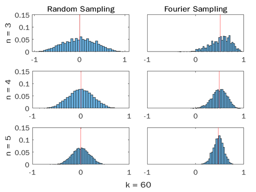

# K-Forrelation Dataset for Benchmarking Hybrid Classical-Quantum Classifiers

*[Updated: Oct 13, 2022]*

*Note: All Rights Reserved - Unpublished research results*

## Table of Content
1. [Motivation](#motivation)
2. [Contributions](#contributions)
3. [Tools Used](#tools)
4. [K-Forrelation Classification Problem](#problem)
5. [Algorithms to generate the dataset](#algorithm)
6. [Guidelines for Generation](#guideline)

> This article is a brief summary of the project, [click here for the full written report]().

## **1. Motivation** 

The need for challenging and relevant datasets to benchmark:
1)	Hybrid classical-quantum classifiers
2)	Algorithms to optimize quantum circuit design for classification tasks

> A few research suggested datasets for quantum machine learning, but they are more suited for training models on quantum control and tomography [(Perrier et al., 2021)](https://arxiv.org/abs/2108.06661) or simply based on heuristic about difficulty in simulating entanglement [(Schatzki et al., 2021)](https://arxiv.org/abs/2109.03400)

A classification dataset based on the k-fold Forrelation (k-Forrelation) problem is interesting because:

* k-Forrelation is formally proved to *maximally separate the query complexity between classical and quantum computation* in the black-box model [(Aaronson, 2014)](https://arxiv.org/abs/1411.5729v1) – which makes it more directly relevant to quantum classifiers than generic datasets **(Note: this research does not attempt to compare quantum against classical classifiers)**

* k-Forrelation decision problem is *PromiseBQP-complete* and has been proved to be within the expressiveness of Variational Quantum Classifier and Quantum Support Vector Machine [(Jager & Krems, 2022)](https://arxiv.org/abs/2207.05865)

* k-Forrelation datasets can be generated with *different parameterizations* that allow evaluation of model performance and computational cost at scales

This research addresses the following challenges regarding the k-Forrelation dataset:

* The positive class is exponentially rare at larger problem sizes, making it prohibitively difficult to sample a balanced dataset

* Random sampling in the function space is incapable of generating examples with high positive thresholds, which requires the development of a novel sampling algorithm

* The k-Forrelation decision problem is theoretically formulated but the relative classification difficulty at different parameterizations have not been studied

The generated k-Forrelation datasets could also enable future research on performance criteria suitable for benchmarking quantum classifiers beyond accuracy (e.g., scalability), or to statistically confirm hypotheses of algorithm improvement.
 
 **Note:** Benchmarking of (classical) machine learning algorithms concern criteria such as model complexity, scalability, sample complexity, interpretability, ability to learn from data stream, performance, among others. It remains an open question what should be the criteria to benchmark quantum algorithms and confirm any hypothesis of performance improvement. This is because the matters of concern for quantum computing are different and include depth of circuit (trainability), coherent time required if storing quantum information, optimizing entanglement, among others. This research suggests some potential use for the k-Forrelation dataset, but leave further discussion on the proper benchmarking of quantum algorithms to future works

 ## **2. Contributions** 
* An algorithm to generate k-Forrelation datasets with high positive class threshold based on approximated Fourier Transform 
* An analysis of the properties of k-Forrelation datasets in classification task
* Guidelines for the generation of k-Forrelation datasets for benchmarking
* Suggestions and demonstration for potential uses of k-Forrelation datasets *(in progress)*

## **3. Tools Used** 
* MATLAB (for development of sampling algorithm and dataset generation) 
* Python (for training composite-kernel SVM and quantum classifers on the datasets)
* Advanced Research Computing (ARC) Cluster to run all codes

## **4. K-Forrelation Classification Problem** 
In 2014, [Aaronson and Ambainis](https://www.scottaaronson.com/papers/for.pdf) proved the maximal separation in query complexity for black-box model between quantum and classical computation. The study involved a property-testing problem called **Forrelation** (originally introduced by [Aaronson, 2009](https://arxiv.org/pdf/0910.4698.pdf)). In Forrelation, two Boolean functions are given and the task is to decide if one function is highly correlated with the Fourier transform of the other. **K-fold Forrelation (or, k-Forrelation)** is the heuristical generalization of Forrelation that applies to k > 2 Boolean functions.  

A review of Fourier analysis on the Boolean Cube can be found [here (de Wolf, 2008)](https://theoryofcomputing.org/articles/gs001/gs001.pdf). This section summarizes the mathematical concepts of discrete Fourier transform on the Boolean cube for the generation of a classification dataset.

### *4.1. Fourier transform on the Boolean cube and correlation*
Consider a function

$$\begin{align}
f : \{0,1\}^n \mapsto \mathbb{R}  
\end{align}$$

The value table $f$ can be represented as a vector in $\mathbb{R}^{2n}$:

$$ 
\begin{align}
    f \equiv \begin{bmatrix}
           f(0\cdots00) \\
           f(0\cdots01) \\
           \vdots \\
           f(1\cdots11)
         \end{bmatrix}
\end{align} 
$$

(we will later focus on functions that map only to Boolean values $-1$ or $+1$. Here, assuming mapping to real numbers without loss of generality)

Define a $2^n \ -$ dimensional function space over $\mathbb{R}$ with inner product:

$$
\begin{align}
\langle f,g \rangle \coloneqq \frac{1}{2^n} \sum_{x \in \{0,1\}^n}f(x)g(x) = \mathbb{E}[f(x)g(x)]  
\end{align}
$$

which defines the $l_2$-norm:

$$
\begin{align}
\Vert f \Vert_2 = \sqrt{\langle f,f \rangle} = \sqrt{\sum_{x \in \{0,1\}^n}f(x)^2}  = \sqrt{\mathbb{E}[f(x)^2] }
\end{align}
$$

Also, define the function $\chi_s(x)$ in the space as:

$$
\begin{align} 
\chi_s(x) = (-1)^{S \cdot x}\sqrt{2^n}
\end{align}
$$

where, $S \subseteq [n]=\{1,2,\dots,n\}$ with its characteristic vector $S \in \{0,1\}^n$. I.e., $S$ is the short-handed notation for a binary string of length $n$ with value 1 at the integer indices indicated by S. For example, $S = \{1,2,4\} \subseteq [5] \rightarrow S \equiv 1\ 1\ 0\ 1\ 0$.

<!---
Note: The definition of $\chi_s$ in Eqn. (5) includes a constant factor which makes the norm of $\chi_s$ not unity. This adjustment is mainly to reconcile with the form K-Forrelation introduced by Aaronson (2014)
--> 

$S \cdot x$ is the sum of the bit-wise product of binary string $S$ and $x$: 

$$
\begin{align} 
S \cdot x = \sum_{i=1}^ns_ix_i = \sum_{i \in S}x_i
\end{align}
$$

It can be shown that $\langle \chi_s,\chi_t\rangle = \delta_{st}$. Thus, the set of all $\chi_s$ forms an orthogonal basis of the function space.

Then, the Fourier Transform of any function $f(x)$ in the space can be defined as:

$$
\begin{align} 
\hat{f}(S) = \langle f, \chi_s \rangle & = \frac{1}{2^n} \sum_{x \in \{0,1\}^n}f(x)\chi_s(x) \\
\hat{f}(S) & = \frac{1}{\sqrt{2^n}} \sum_{x \in \{0,1\}^n} (-1)^{S \cdot x} f(x)
\end{align}
$$

Given two functions $f(x), \ g(x): \{0,1\}^n \mapsto \mathbb{R} $, computing the inner product of $f(x)$ and the Fourier transform of $g(x)$:

$$
\begin{align}
\langle f, \hat{g} \rangle &= \frac{1}{2^n} \sum_{x \in \{0,1\}^n}f(x)\hat{g}(x) \\
&= \frac{1}{2^n}\sum_{x \in \{0,1\}^n}f(x) \left( \frac{1}{\sqrt{2^n}} \sum_{y \in \{0,1\}^n} (-1)^{x \cdot y} g(y) \right) \\
& = \frac{1}{2^\frac{3n}{2}} \sum_{x,\ y \ \in \{0,1\}^n}f(x)(-1)^{x \cdot y}g(y) \\
\Phi_{f,g} & \coloneqq \frac{1}{2^\frac{3n}{2}} \sum_{x,\ y \ \in \{0,1\}^n}f(x)(-1)^{x \cdot y}g(y)
\end{align}
$$

$\Phi_{f,g}$ from Eqn. (12) is a measure of how correlated is $f(x)$ to the Fourier transform of $g(x)$.

The form of $\Phi$ can be heuristically generalize to $k$ functions, called k-Fold Forrelation or, k-Forrelation for short:

$$
\begin{align}
\boxed{
\Phi_{f_1,\dots,f_k} = \frac{1}{2^{n(k+1)/2}} \sum_{x_1,\dots,x_k \in \{0,1\}^n}f_1(x_1)(-1)^{x_1 \cdot x_2}f_2(x_2) \dots (-1)^{x_{k-1} \cdot x_k}f_k(x_k)
}
\end{align}
$$

### *4.2. k-Fold Forrelation Problem*

If we restrict the range of $f_k: \{0,1\}^n \mapsto \pm 1$ (instead of $\mathbb{R}$), $\Phi_{f_1,\dots,f_k}$ is precisely the amplitude with which the circuit shown in Fig. (1) returns $|0 \rangle ^{\otimes n}$ as its output (Aaronson, 2014)

 Figure 1. A quantum circuit that can be taken to define the k-fold Forrelation problem.  (Aaronson, 2014) 

Where $U_{f_k}$ maps each basis state $|x\rangle$ to $f_i(x)|x\rangle$

Since $\Phi$ represents amplitude of the zero-bitstring, we see that $|\Phi_{f_1,\dots,f_k}| \le 1$. 

**The decision problem:** Decide whether $|\Phi_{f_1,\dots,f_k}| \le \frac{1}{100}$ (no correlation) or $|\Phi_{f_1,\dots,f_k}| \ge \frac{3}{5}$ (high correlation) promised that one of them is the case. 

This decision problem was used to prove the maximal separation in query complexity between quantum and classical computation [(Aaronson, 2014)](https://arxiv.org/abs/1411.5729v1). Recently, [(Jager & Krems, 2022)](https://arxiv.org/abs/2207.05865) showed that variational quantum classifiers and quantum kernels have the theoretical expressiveness to solve the k-Forrelation problem (which is known to be PromiseBQP-complete). However, the authors used the exact quantum circuit that described the k-Forrelation problem as the feature map for both methods in the proof. 

The question remains to find a quantum classifier architecture capable of learning the k-Forrelation problem without the characteristic feature map (circuit in Fig. (1)) provided. This effort requires the generation of k-Forrelation datasets at various scales (length of input bitstring $n$, number of function $k$, and the positive class threshold). Generating a balance dataset is difficult since the positive class is much rarer than the negative class, especially at larger $k$ and $n$. The current research investigates the properties of and challenges in generating the k-Forrelation datasets, as well as proposes an algorithm to sample balanced datasets. 

## **5. Algorithms to generate the datasets**

Conditions on the functions to be sampled:

* Each function is Boolean in the general function space $f(x): \{0,1\}^n \mapsto \{+1,-1\}$
* Each function is of the form $f(x) = (-1)^{C_i(x)}$ where $C_i(x)$ is a product of at most 3 input bits, or chosen to be constant $f(x)=1$
* The number of function in each ensemble is at least three ( $k \ge 3$ )

> The space of all Boolean functions is called the *general space*. Boolean functions that satisfy the above conditions are said to be in the *policy space*

Structure of the datasets:

* Each problem instance is characterized by three parameters:
  * Length of binary input $n$
  * Number of Boolean functions $k$
  * Threshold of positive class $\mu$ (the value of $\Phi$ above which an example is attributed the positive class)
* Each example is one-hot encoded with length $n \times k$
* Condition on the number of functions $k \le \text{poly}(n)$

With $k$ functions randomly sampled from the *general space*, the value of $\Phi$ could be thought of as a random variable in the range $[-1,1]$. 

It can be proved that $\mathbb{E}_{f_1,\dots,f_k} (\Phi) = 0$ and $\text{Var}_{f_1,\dots,f_k} (\Phi) = \frac{1}{2^n}$, which implies that the distributions of $\Phi$ in the *general space* peaks around $0$ with standard deviation independent of $k$ and decreasing exponentially in $n$

Figure 2. Distributions of $\Phi$ for random sampling in *general space* with increasing values of $n$ and $k$

A similar trend can be seen for $\Phi$ in the *policy space*

Figure 3. Distributions of $\Phi$ for random sampling in *policy space* with increasing values of $n$ and $k$

### **Random Generation**

Algorithm: 

* Randomly sample $k$ Boolean functions from the space to make a k-Forrelation example
* Calculate the value of $\Phi$
* Keep or discard the example depending on the desired class to be generated

Pros:
* Create the most general datasets since the sampling algorithm enforces no correlation between the $k$ sampled functions

Cons:
* Cannot generate positive class at higher $n$ or higher positive threshold

### **2-Forrelation Generation**
[Aaronson (2014)](https://arxiv.org/abs/1411.5729v1) introduces an algorithm to generate the positive class for the case of *2-Forrelation*. To generate two Boolean functions that are highly likely to be forrelated:
* Generate a random vector $\boldsymbol{v} \in \mathbb{R}^{2^n}$ with each entry sampled from the normal distribution $\mathcal{N}(0,1)$
* Set $f_1 = \text{sign}(\boldsymbol{v})$ and $f_1 = \text{sign}(\hat{\boldsymbol{v}})$, where $\hat{\boldsymbol{v}}$ is the discrete Fourier transform of $\boldsymbol{v}$

### **K-Forrelation Generation**

Since *2-Forrelation* is not a sub-problem of k-Forrelation, it is not trivial to find a generation algorithm that would work to generate k-Forrelation ensambles with arbitrary number of functions ( $k \ge 2$ ). 

Here I proposes a generalization of the sampling strategy for any arbitrary number of functions. This is done by leveraging the recursive linearized form of $\Phi$ and the re-sampling of the randomized vector $\boldsymbol{v}$ to perform approximate Fourier Transform. First, we can write $\Phi$ as:

$$
\Phi(k>2,n) = \frac{1}{2^{(k+1)n/2}} \ \text{sum}(\overrightarrow{\Omega_k}) \, \\ \text{where,} \

\begin{cases}
   \overrightarrow{\Omega_2} & = (H\vec{f}_1) \ \odot \ \vec{f_2} \\
   \overrightarrow{\Omega_k} & = (H\vec{f}_{k-1}) \ \odot \ \vec{f_k}
\end{cases}
$$

$H$ is the matrix representation of the unitary where Hadamard gates are applied to all $n$ qubits (a constant matrix given $n$). $H$ can also be viewed as the matrix that stores information about the value of dot products of the binary input bit strings of length $n$

The idea is to view $\overrightarrow{\Omega}_{k-1}$ as approximately a function $f_{k-1}$. Then, following the 2-Forrelation sampling algorithm, $f_{k-1}$ can be taken to possess the sign of some randomly generated random vector $\boldsymbol{v}$. We thus generate a random vector from $\mathcal{N}(0,1)$ and assign to it the sign of $f_{k-1}$. Finally, we have $f_k = \text{sign}(\hat{\boldsymbol{v}})$. The pseudo-code is shown below:

**FOURIER GENERATOR (k)**:

&emsp; if $k=1$:

&emsp;&emsp;choose $f_1$ randomly from the space

&emsp;&emsp;generate random vector $\boldsymbol{v}$ from the standard normal distribution

&emsp;&emsp;assign sign of $f_1$ to the absolute-valued vector $|\boldsymbol{v}|$ to obtain $\boldsymbol{v}'$

&emsp;&emsp;return [ $f_1$ ], $\boldsymbol{v}'$

&emsp; else:

&emsp;&emsp;previous functions, $\boldsymbol{v}'_{k-1} =$  **FOURIER GENERATOR (k-1)**

&emsp;&emsp; $f_k = \text{sign} (\boldsymbol{v}'_{k-1})$

&emsp;&emsp;calculate $\overrightarrow{\Omega_k}$

&emsp;&emsp;generate random vector $\boldsymbol{v}_k$ from the standard normal distribution 

&emsp;&emsp;assign sign of  $\overrightarrow{\Omega_k}$ to the absolute-valued vector $|\boldsymbol{v}_k|$ to obtain $\boldsymbol{v}'_k$

&emsp;&emsp;return [previous functions, $f_k$], $\boldsymbol{v}'_k$

&emsp; end if

Figure 4. $\Phi$ distributions for random sampling and Fourier sampling in *general space* with $n$ from $3$ to $5$ and $k = 60$ 

Figure 5. $\Phi$ distributions for random sampling and Fourier sampling in *policy space* with $n$ from $3$ to $5$ and $k = 60$ 

> In the *general space*, Fourier sampling increases $\mathbb{E}[\Phi]$ to around 0.5. In the *policy space*, Fourier sampling increases $\mathbb{E}[\Phi]$ to around 0.25, which will still approach 0 if $n$ grows further. That said, for intermediate values of $n$, Fourier sampling allows significant improvement over random sampling in generating the positive class when threshold is far from 0.

## **6. Guideline for Generation** 

A characterization of the generated datasets using classical SVM with Bayesian-optimized kernel can be found in the [Full Written Report]()

Here is summary of the guidelines for generating the k-Forrelation datasets:

* **Choose $n$**: Go as high as desirable, or computationally capable, depending on the purpose. If $N$ is the number of qubits being used in a quantum classifier, then it is suggested that $n \le N$
* **Choose $k$**: Go as high as possible according to the chosen $n$, with the restriction $k = \text{poly}(n)$. From our experiments, $k \approx n^2$ is a good heuristic
* **Choose positive threshold**: Near 0, but not overlapping with the negative class (defined to be instances with $|\Phi|  \le 0.01$) – e.g., around $0.02$
* **Generative algorithm**: Random Sampling (for $n < 10$). Larger $n$ would require Fourier Sampling, but the dataset is expected to be relatively easier than randomly sampled

**GENERATING WITH MATLAB**

The k-Forrelation datasets can be generated using the MATLAB class `KForrClass.m`

To generate a dataset using **Random Sampling** use `getDatasetRandomSamp` function. E.g., to randomly sample from the *general space* a k-Forrelation set with:
* $n=5$
* $k=21$
* Negative Threshold = 0.01
* Positive Threshold = 0.50
* Class: Positive
* Number of samples: 10000
* Weights of functions: Uniform

Use `getDatasetRandomSamp("general", 5, 21, 0.5, 0.01, +1, 10000, [])`

To generate a dataset using **Fourier Sampling** use `getDatasetFourier` function. E.g., to fourier sample from the *policy space* a k-Forrelation set with:
* $n=7$
* $k=30$
* Negative Threshold = 0.02
* Positive Threshold = 0.30
* Class: Negative
* Number of samples: 1000

Use `getDatasetFourier("fourier", 7, 30, 0.01, 0.30, -1, 1000)`

The function will return the encoded dataset, the raw dataset (with functions as value tables), and the frequency of sampling the class according to the specified positive and negative class policy.

